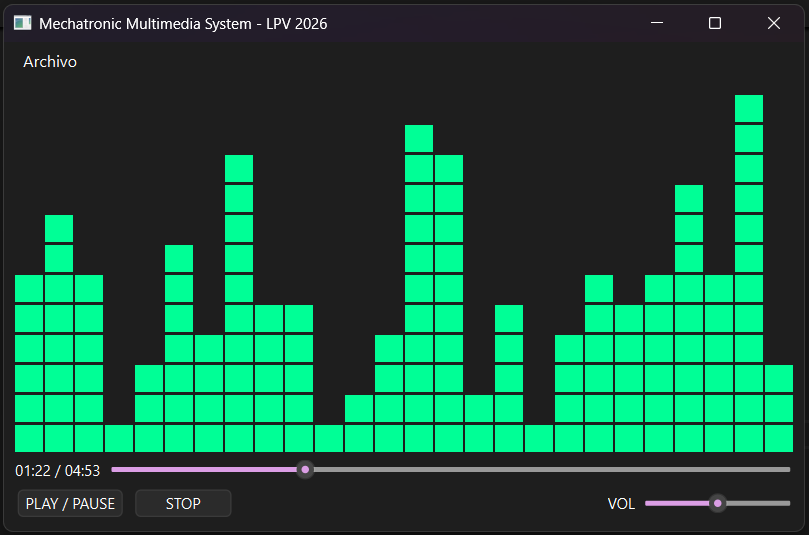

# Lenguaje de Programación Visual

### Ingeniería Mecatrónica

**Semana 2: Diseño UI y Layouts con PyQt6**


**PyQt** es una librería de Python para crear aplicaciónes GUI con Qt toolkit, fue creada por **Riverbank Computing Limited** desarrollada desde 1999. La ultima versión basada en Qt6 es **PyQt6** fue publicada en 2021 con y cuenta con actualizaciones continuas.

PyQt6 puedes crear ventanas, botones, etiquetas de texto, campos de entrada, layouts (diseños), menús, eventos interactivos y aplicaciónes completas con interfaz gráfica.

Funciona mediante una arquitectura basada en:
* **QApplication** → controla la aplicación
* **Siganls, Slots and Events** → comunicación entre eventos y funciones
* **QWidgets** → elementos visuales
* **Layouts** → organización de QWidgets
* **Menus and Toolbars** → menús y barras de herramientas

Como el desarrollo de aplicaciónes con Qt meramente con código Python puede ser muy tedioso y poco optimo para interfaces complejas, se puede utilizar el entorno de diseño Qt Designer para crear interfaces de usuarios de forma visual, sin embargo, es necesario tener conocimientos básicos de Qt para poder utilizar este entorno.

**Instalación de dependencias**

Agrega PyQt6 al proyecto usando poetry:

```bash
poetry add pyqt6
```

Verifica la instalación:

```bash
poetry run python -c "import PyQt6"
```

## QtApplication

La clase `QApplication` es la encargada de gestionar todos los recursos de la aplicación como el loop permanente de escucha de eventos (pulsar una tecla, mover el mouse, etc.).

Solo debe haber una y solo una instancia de `QApplication` por aplicación.

Ejemplo básico de `app.py`:
```python
from PyQt6.QtWidgets import QApplication, QWidget, QPushButton

app = QApplication([])

window = QWidget()
window.show()

app.exec()
```

> Nota: Todos los Qt Wigets pueden ser "window", por ejemplo cambiando QWidget por QPushButton("Click") crea un botón, esto es porque todos las clases Qt Widgets son clases hija de QWidget.

## Widgets

Los Widgets son elementos visuales de la aplicación, por ejemplo un botón, un campo de texto, una etiqueta, etc.

### 1. Widgets básicos

Todos los widgets de Qt son clases hijas de QWidget, de entre los cuales tenemos los widgets elementales o básicos:

* QLabel: texto
```python3
window = QWidget()
label = QLabel("Hola Mecatrónica", parent=window)
```
* QPushButton: botón
```python3
def on_click():
    print("Botón presionado")
window = QWidget()
button = QPushButton("Presionar", parent=window)
button.clicked.connect(on_click)
```
* QLineEdit: campo de texto
```python3
window = QWidget()
input = QLineEdit("Hola Mecatrónica", parent=window)
```
* QCheckBox: checkbox
```python3
window = QWidget()
check = QCheckBox("Checkbox", parent=window)
``` 
* QComboBox: combobox
```python3
window = QWidget()
combo = QComboBox(parent=window)
combo.addItems(["Opción 1", "Opción 2", "Opción 3"])
```
* QSlider: slider
```python3
window = QWidget()
slider = QSlider(parent=window)
slider.setRange(0, 100)
slider.setValue(50)
```


Ejemplo unificado de widgets básicos en `app.py`:

```python
import sys
from PyQt6.QtWidgets import QApplication, QWidget, QLabel, QPushButton, QLineEdit, QCheckBox, QComboBox, QSlider, QMessageBox

def mostrar_mensaje():
    msg = QMessageBox(window)
    msg.setText("Interacción detectada")
    msg.exec()

app = QApplication(sys.argv)

window = QWidget()
window.setWindowTitle("Ejemplo Widgets")
window.resize(400, 450)

# QLabel
label = QLabel("Hola Mecatrónica", parent=window)
label.move(30, 20)

# QPushButton
button = QPushButton("Presionar", parent=window)
button.move(30, 60)
button.clicked.connect(mostrar_mensaje)

# QLineEdit
input_field = QLineEdit("Hola Mecatrónica", parent=window)
input_field.move(30, 110)
input_field.returnPressed.connect(mostrar_mensaje)

# QCheckBox
check = QCheckBox("Checkbox", parent=window)
check.move(30, 160)
check.clicked.connect(mostrar_mensaje)

# QComboBox
combo = QComboBox(parent=window)
combo.addItems(["Opción 1", "Opción 2", "Opción 3"])
combo.move(30, 210)
combo.activated.connect(mostrar_mensaje)

# QSlider
slider = QSlider(parent=window)
slider.setRange(0, 100)
slider.move(30, 260)
slider.sliderReleased.connect(mostrar_mensaje)

window.show()

sys.exit(app.exec())
```
### 2. QMainWindow

QMainWindow es una clase que contiene un set de widgets modificables por herencia como la barra de menú, la barra de herramientas, la barra de estado, entre otros. Además, pueden incorporarse widgets básicos que interactúan dentro de la clase preprogramada modulando asi el código entre app.py y demás módulos.

Ejemplo básico

En `myWindow.py`:
```python
from PyQt6.QtWidgets import QMainWindow, QPushButton

class MyWindow(QMainWindow):
    def __init__(self):
        super().__init__()
        self.setWindowTitle("Mi primera ventana PyQt6")
        
        button = QPushButton("Click")
        self.setCentralWidget(button)
        button.clicked.connect(self.on_click)

    def on_click(self):
        print("Evento de botón presionado")
```

En `app.py`:
```python
from PyQt6.QtWidgets import QApplication
from myWindow import MyWindow
import sys

app = QApplication(sys.argv)
window = MyWindow()
window.show()
app.exec()
```

## Events, Signals and Slots

Los `Signals` son notificaciones  emitidas por un widget como respuesta a un `Event`, es decir, cuando algo ocurre como: como presionar un botón o cuando el texto de un inputbox cambia

Los `Slots` son funciones que se ejecutan cuando se emite un `Signal`, son equivalente de los `EventListeners` o `handler` de otros lenguajes.

Ejemplo básico en `app.py`:

```python
import sys
from PyQt6.QtWidgets import QApplication, QMainWindow, QPushButton


class MainWindow(QMainWindow):
    def __init__(self):
        super().__init__()

        self.setWindowTitle("My App")

        button = QPushButton("Press Me!")
        button.setCheckable(True)

        # Conectamos el slot al signal
        button.clicked.connect(self.the_button_was_clicked)
        self.setCentralWidget(button)

    # Este es el slot
    def the_button_was_clicked(self, checked):
        print(f"The button was clicked! Checked: {checked}")


app = QApplication(sys.argv)

window = MainWindow()
window.show()

app.exec()
```

## Layouts
Una forma relativamente eficiente de organizar los widgets en una ventana es utilizando layouts, estos permiten organizar los widgets de una forma controlada y dinámica.
Qt cuenta con los siguietes tipos de Layouts de la siguiente tabla:

| Layout | Descripción |
| --- | --- |
| QGridLayout | Permite organizar los widgets en un tablero |
| QHBoxLayout | Permite organizar los widgets en una fila horizontal |
| QGridLayout | Permite organizar los widgets en un tablero |
| QVBoxLayout | Permite organizar los widgets en una columna vertical |
| QFormLayout | Permite organizar los widgets en un formulario |
| QStackLayout | Permite organizar los widgets en una pila |

Adicionalmente, Qt también cuenta con los QtStackedLayout, que permite organizar los widgets uno encima de otro.

Para un mejor entendimiento crearemos un custom widget Color

código de Color en `layout_colorwidget.py`:

```python
from PyQt6.QtGui import QColor, QPalette
from PyQt6.QtWidgets import QWidget


class Color(QWidget):
    def __init__(self, color):
        super().__init__()
        self.setAutoFillBackground(True)

        palette = self.palette()
        palette.setColor(QPalette.ColorRole.Window, QColor(color))
        self.setPalette(palette)
```
En `app.py`
```python
import sys

from PyQt6.QtWidgets import QApplication, QMainWindow, QWidget

from layout_colorwidget import Color


class MainWindow(QMainWindow):
    def __init__(self):
        super().__init__()
        self.setWindowTitle("My App")

        widget = Color("red")
        self.setCentralWidget(widget)


app = QApplication(sys.argv)
window = MainWindow()
window.show()
app.exec()
```
### QVBoxLayout
Con `QVBoxLayout` los widgets se organizan en una columna vertical, el primer widget se coloca en la parte superior y el último widget se coloca en la parte inferior de la columna.

En `app.py`:
```python
class MainWindow(QMainWindow):

    def __init__(self):
        super().__init__()
        self.setWindowTitle("My App")

        layout = QVBoxLayout()

        layout.addWidget(Color("red"))
        layout.addWidget(Color("green"))
        layout.addWidget(Color("orange"))
        layout.addWidget(Color("blue"))

        widget = QWidget()
        widget.setLayout(layout)
        self.setCentralWidget(widget)
```
### QHBoxLayout
Con `QHBoxLayout` los widgets se organizan en una fila horizontal, el primer widget se coloca en la parte izquierda y el último widget se coloca en la parta derecha de la fila.

En `app.py`:
```python
class MainWindow(QMainWindow):
    def __init__(self):
        super().__init__()
        self.setWindowTitle("My App")

        layout = QHBoxLayout()

        layout.addWidget(Color("red"))
        layout.addWidget(Color("green"))
        layout.addWidget(Color("orange"))
        layout.addWidget(Color("blue"))

        widget = QWidget()
        widget.setLayout(layout)
        self.setCentralWidget(widget)
```

### QGridLayout
Con `QGridLayout` los widgets se organizan como matriz, el primer widget se coloca en la parte superior izquierda y el último widget se coloca en la parte inferior derecha de la matriz.

En `app.py`:
```python
from layout_colorwidget import Color
from PyQt6.QtWidgets import QGridLayout, QMainWindow, QWidget

class MainWindow(QMainWindow):
    def __init__(self):
        super().__init__()
        self.setWindowTitle("My App")

        layout = QGridLayout()

        layout.addWidget(Color("red"), 0, 3)
        layout.addWidget(Color("green"), 1, 1)
        layout.addWidget(Color("orange"), 2, 2)
        layout.addWidget(Color("blue"), 3, 0)

        widget = QWidget()
        widget.setLayout(layout)
        self.setCentralWidget(widget)
```

## Toolbars and Menus
**Toolbars**

El ToolBar es una barra de herramientas (usualmente con iconos) que se coloca en la parte superior de la ventana, permite a los usuarios realizar acciones rápidas y comunes.

Usaremos como esqueleto de código en `app.py`:
```python
from PyQt6.QtCore import QSize, Qt
from PyQt6.QtGui import QAction, QIcon, QKeySequence
from PyQt6.QtWidgets import (
    QApplication,
    QCheckBox,
    QLabel,
    QMainWindow,
    QStatusBar,
    QToolBar,
)

class MainWindow(QMainWindow):
    def __init__(self):
        super().__init__()
        self.setWindowTitle("My App")

app = QApplication([])
window = MainWindow()
window.show()
app.exec()
```
En Qt los los toolBars son creados con `QToolBar`, luego de ser instanciados deben ser agregados a la ventana principal con el método `addToolBar` en la custom class de `QMainWindow`.

```python
toolbar = QToolBar("My main toolbar")
self.addToolBar(toolbar)
```

Para agregar funcionalidades al toolbar, se pueden crear acciones con `QAction`, que son objetos que se pueden conectar a los eventos de los botones
```python
button_action = QAction("Your button", self)
button_action.setStatusTip("This is your button")
button_action.triggered.connect(self.toolbar_button_clicked)
toolbar.addAction(button_action)
```

A su vez podemos crear un statusBar con `QStatusBar` y agregarlo a la ventana con el método `setStatusBar`.
```python
self.setStatusBar(QStatusBar(self))
```

Para agregar un icono a la barra de herramientas, se puede utilizar el método `setIcon` de la barra de herramientas teniendo en cuenta que el icono debe ser un `QIcon`.

Para este ejemplo usaremos el icono que tenemos en la misma carpeta que el proyecto, el icono es `bug.png`, diseñado por Yusuke Kamiyamane [set de iconos](http://p.yusukekamiyamane.com/)

```python   
button_action = QAction(QIcon("bug.png"), "&Your button", self)
```

Resultando asi en `app.py`:
```python
class MainWindow(QMainWindow):
    def __init__(self):
        super().__init__()
        self.setWindowTitle("My App")

        label = QLabel("Hello!")
        label.setAlignment(Qt.AlignmentFlag.AlignCenter)

        self.setCentralWidget(label)

        toolbar = QToolBar("My main toolbar")
        toolbar.setIconSize(QSize(16, 16))
        self.addToolBar(toolbar)

        button_action = QAction(QIcon("bug.png"), "Your button", self)
        button_action.setStatusTip("This is your button")
        button_action.triggered.connect(self.toolbar_button_clicked)
        button_action.setCheckable(True)
        toolbar.addAction(button_action)

        self.setStatusBar(QStatusBar(self))

    def toolbar_button_clicked(self, s):
        print("click", s)
```

Los MenuBar son una barra que se encuentra en la parte superior de la ventana (por encima de la barra de herramientas), permite a los usuarios realizar acciones rápidas y desplegar otras herramientas.

**Menu**

En Qt los MenuBars se crean con `menuBar` que es un objeto del `QMainWindow`, por lo que no es instanciado como un elemento nuevo, para agregar funcionalidades se emplea el método `addAction` de la barra de menús.

```python
menu = self.menuBar()
file_menu = menu.addMenu("&File")
file_menu.addAction(button_action)
```

Resultando en `app.py`:
```python
class MainWindow(QMainWindow):
    def __init__(self):
        super().__init__()
        self.setWindowTitle("My App")

        label = QLabel("Hello!")
        label.setAlignment(Qt.AlignmentFlag.AlignCenter)

        self.setCentralWidget(label)

        toolbar = QToolBar("My main toolbar")
        toolbar.setIconSize(QSize(16, 16))
        self.addToolBar(toolbar)

        button_action = QAction(QIcon("bug.png"), "&Your button", self)
        button_action.setStatusTip("This is your button")
        button_action.triggered.connect(self.toolbar_button_clicked)
        button_action.setCheckable(True)
        toolbar.addAction(button_action)

        toolbar.addSeparator()

        button_action2 = QAction(QIcon("bug.png"), "Your &button2", self)
        button_action2.setStatusTip("This is your button2")
        button_action2.triggered.connect(self.toolbar_button_clicked)
        button_action2.setCheckable(True)
        toolbar.addAction(button_action2)

        toolbar.addWidget(QLabel("Hello"))
        toolbar.addWidget(QCheckBox())

        self.setStatusBar(QStatusBar(self))

        menu = self.menuBar()

        file_menu = menu.addMenu("&File")
        file_menu.addAction(button_action)
        file_menu.addSeparator()
        file_menu.addAction(button_action2)

    def toolbar_button_clicked(self, s):
        print("click", s)
```

## **Ejercicio**

Desarrollar un reproductor de musica usando pyQt6 con los siguientes elementos:
- Un barra de menu con `self.menuBar()` y `QAction` para abrir un archivo de audio, la estructura básica es Archivo -> Abrir Archivo
- Un mosaico de 12 x 23 cuadros de color verde programados con `QGridLayout` que cambiarán de color aleatoriamente por columnas cuando la canción se reproduce
- Un slider de progreso con `QSlider` que se encargara de controlar y mostrar el tiempo de la cancion
- Un panel de controles que tendra los botones de `PLAY/PAUSE`, `STOP` y un slider de volumen
- El mosaico, el slider de progreso y el panel de controles deben estar en `QHBoxLayout` independientes, es decir se tendran 3 filas principales

<p align="center">
  
</p>


Para la gestion del audio usaremos el `QMediaPlayer` y `QAudioOutput` de la libreria `PyQt6.QtMultimedia`

Para el mosaico de colores usaremos un custom widget `LEDSquare` que heredara de `QWidget` y que tenga un método `set_state` que cambiara el color del widget dependiendo si está activo o no.

```python
from PyQt6.QtGui import QColor, QPalette
from PyQt6.QtWidgets import QWidget

class LEDSquare(QWidget):
    def __init__(self):
        super().__init__()
        self.setAutoFillBackground(True)
        self.setFixedSize(22, 22)
        self.set_state(False)

    def set_state(self, active):
        # Color verde brillante para activo, gris oscuro para inactivo
        color = QColor(0, 255, 150) if active else QColor(30, 30, 30)
        palette = self.palette()
        palette.setColor(QPalette.ColorRole.Window, color)
        self.setPalette(palette)
```

Toda la aplicación debe programarse en `app.py` dentro de la clase 
`class MusicPlayerPro(QMainWindow)`
