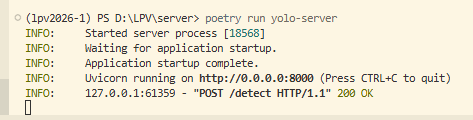
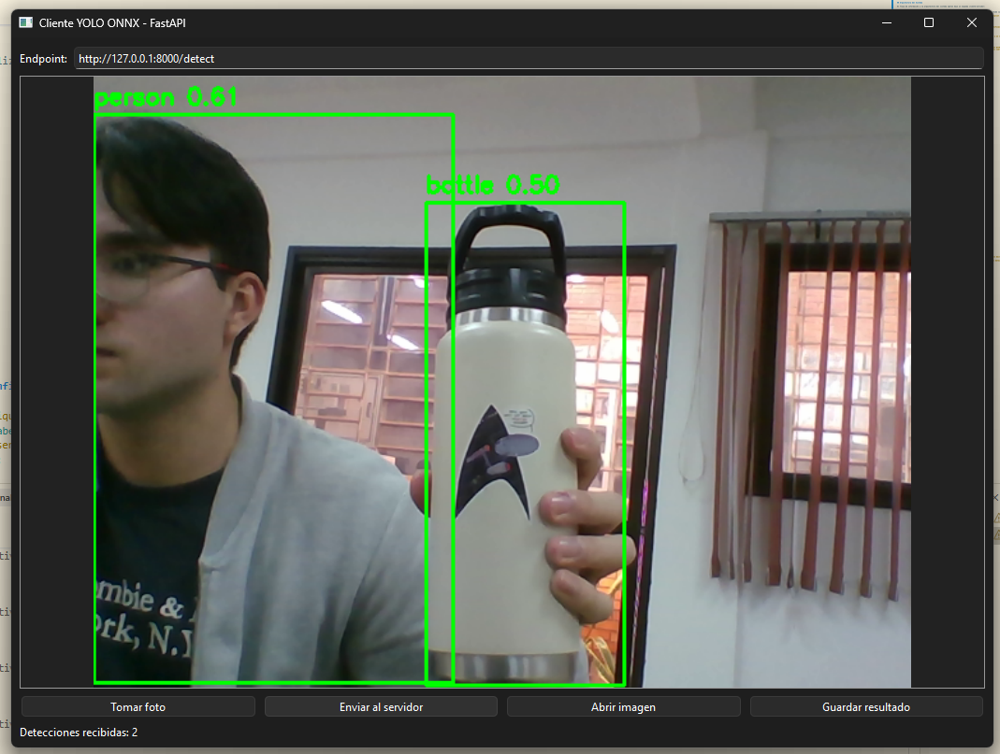

# Lenguaje de Programación Visual  
## Ingeniería Mecatrónica

**Semana 10: FastAPI**

---

Este repositorio contiene un proyecto estructurado en dos módulos. El sistema demuestra la integración de una interfaz gráfica de usuario y un backend de inferencia de visión computacional.

## Arquitectura del Sistema

El flujo de información y la arquitectura del sistema operan bajo un esquema cliente-servidor:

### 1. Inferencia Optimizada (Torch a ONNX)
El motor de detección utiliza un modelo YOLO. Para entornos de producción, el modelo se ha convertido desde su formato original de entrenamiento en PyTorch (`.pt`) a la especificación ONNX (Open Neural Network Exchange). **Beneficios técnicos:** Se elimina la dependencia del runtime completo de PyTorch, reduciendo el footprint de memoria. La inferencia se delega a `onnxruntime` (implementado en C/C++), minimizando la carga de CPU y la latencia por procesamiento.

### 2. Módulo Servidor (FastAPI)
Microservicio encargado exclusivamente de la inferencia.
<p align="center">
  
</p>
* **Interfaz de red:** Expone una API REST con el endpoint asíncrono `POST /detect`.
* **Recepción de datos:** Acepta peticiones HTTP que contienen buffers binarios de imágenes mediante codificación `multipart/form-data`.
* **Procesamiento:** 
  1. Decodifica el payload binario a un array matricial de NumPy (formato BGR) usando OpenCV.
  2. Preprocesa el tensor y ejecuta la inferencia a través de la sesión de `onnxruntime`.
  3. Aplica Non-Maximum Suppression (NMS) para el filtrado topológico de cajas delimitadoras.
* **Respuesta:** Serializa y retorna un payload JSON estructurado con las dimensiones base de la imagen y un vector de detecciones que incluye coordenadas espaciales (x1, y1, x2, y2), índices de clase y valores de precisión (confidence).

### 3. Módulo Cliente (PyQt6)
Aplicación de escritorio encargada de la captura, visualización y transporte de datos.
<p align="center">
  
</p>
* **Captura:** Extrae frames de hardware local (cámara web) mediante `cv2.VideoCapture`.
* **Transmisión:** Codifica el frame actual en memoria a JPEG (`cv2.imencode`) y genera una petición POST HTTP síncrona al servidor utilizando la librería `requests`.
* **Renderizado:** Parsea la respuesta JSON del servidor, interpola las coordenadas de las bounding boxes sobre el array de la imagen original, aplica funciones de dibujado, transforma el resultado a un objeto `QImage` y refresca el renderizado gráfico de PyQt6.

---

## Despliegue y Ejecución

### 1. Servidor
Inicialización del entorno virtual y arranque del proceso Uvicorn:

```bash
cd server
poetry install
poetry run yolo-server
```

**Código principal de creación y lanzamiento del servicio:**
```python
from fastapi import FastAPI, File, UploadFile
import cv2
import numpy as np
import uvicorn

app = FastAPI()

@app.post("/detect")
async def detect(file: UploadFile = File(...)):
    # Lectura y decodificación
    data = await file.read()
    array = np.frombuffer(data, dtype=np.uint8)
    image = cv2.imdecode(array, cv2.IMREAD_COLOR)
    
    # Inferencia
    detections = get_detector().predict(image)
    
    # Retorno serializado JSON
    return {"detections": [d.__dict__ for d in detections]}

def run():
    uvicorn.run("app.main:app", host="0.0.0.0", port=8000)

if __name__ == "__main__":
    run()
```

* **Endpoint Base:** `http://127.0.0.1:8000`
* **Swagger UI / OpenAPI:** `http://127.0.0.1:8000/docs`

### 2. Cliente
Lanzamiento de la interfaz gráfica en un proceso de terminal secundario:

```bash
cd client
poetry install
poetry run yolo-client
```

**Código de consumo de la API desde el cliente:**
```python
import cv2
import requests

# Codificación del frame local a memoria
ok, encoded = cv2.imencode(".jpg", frame)

# Petición POST con el archivo binario adjunto
response = requests.post(
    "http://127.0.0.1:8000/detect",
    files={"file": ("capture.jpg", encoded.tobytes(), "image/jpeg")},
    timeout=30,
)
response.raise_for_status()

# Deserialización de los resultados
detections = response.json().get("detections", [])
```

---

## Especificación de la API

### Petición
* **Ruta:** `POST /detect`
* **Cabecera Content-Type:** `multipart/form-data`
* **Cuerpo:** Archivo de imagen codificado.

### Respuesta (JSON)
Esquema de la respuesta serializada devuelta por el servicio:

```json
{
  "image_width": 1280,
  "image_height": 720,
  "detections": [
    {
      "label": "person",
      "class_id": 0,
      "confidence": 0.91,
      "x1": 100.0,
      "y1": 120.0,
      "x2": 180.0,
      "y2": 210.0
    }
  ]
}
```

---

## Parámetros de Entorno y Configuración

* **Mapeo de Clases:** Las etiquetas correspondientes a los `class_id` devueltos por el modelo ONNX deben declararse (una por línea y en estricto orden) en el archivo de texto estático `server/onnx_model/labels.txt`.
* **Ajuste Algorítmico:** La sensibilidad de los parámetros Non-Maximum Suppression (NMS) y el umbral de detección estricto (confidence) pueden ser ajustados a nivel global previo al inicio del servidor:

**Windows (CMD/PowerShell):**
```bash
set YOLO_CONF=0.25
set YOLO_IOU=0.45
```

**Linux/macOS:**
```bash
export YOLO_CONF=0.25
export YOLO_IOU=0.45
```
