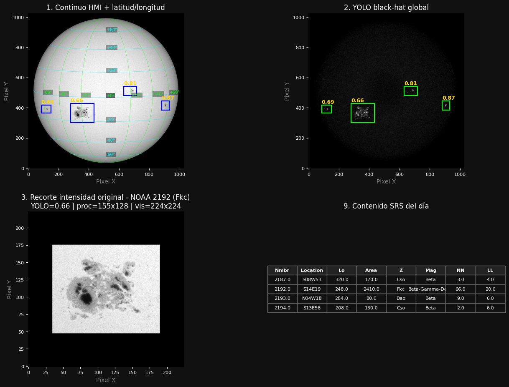

# Lenguaje de Programación Visual

### Ingeniería Mecatrónica

**Semana 3: Bases de datos**

En esta guia rapida aprenderemos a crear una base de datos en Supabase, cargar los datos y vincularlos con pyqt6 para su consumo.

La consigna es un entorno grafico para visualizar los registros de clasificacion Zurich-McIntosh de manchas solares y agregar un registro del dia actual, los datos corresponden a registros de manchas solares de la NOAA.

<p align="center">
  
</p>

1. Primero crea una cuenta en Supabase y vinculada a tu github preferentemente.

2. Crea un proyecto nuevo en Supabase.

3. Entra en el apartado de My SQL, copia y pega el codigo, luego ejecutalo:

```sql
create extension if not exists pgcrypto;

create table if not exists public.datasets (
    id uuid primary key,
    name text not null,
    version text not null,
    description text,
    labels_csv_name text,
    num_crops integer default 0,
    num_full_disk_images integer default 0,
    created_at timestamptz not null default now(),
    unique(name, version)
);

create table if not exists public.full_disk_images (
    id uuid primary key,
    dataset_id uuid not null references public.datasets(id) on delete cascade,
    file_name text not null,
    storage_bucket text not null,
    storage_path text not null,
    date_obs date,
    width integer,
    height integer,
    num_crops integer default 0,
    noaa_list jsonb,
    metadata_json jsonb,
    created_at timestamptz not null default now(),
    unique(dataset_id, file_name),
    unique(storage_bucket, storage_path)
);

create table if not exists public.sunspot_crops (
    id uuid primary key,
    dataset_id uuid not null references public.datasets(id) on delete cascade,
    full_disk_image_id uuid not null references public.full_disk_images(id) on delete cascade,
    crop_filename text not null,
    storage_bucket text not null,
    storage_path text not null,
    full_disk_filename text,
    crop_index integer,
    date_obs date,
    z_class text,
    p_class text,
    c_class text,
    mcintosh_full text,
    pred_z text,
    pred_p text,
    pred_c text,
    pred_mcintosh_full text,
    noaa bigint,
    lat double precision,
    lon double precision,
    carrington_lo double precision,
    extension_ll double precision,
    area double precision,
    mag_class text,
    num_spots_srs integer,
    orig_w integer,
    orig_h integer,
    square_size integer,
    yolo_conf double precision,
    created_at timestamptz not null default now(),
    unique(dataset_id, crop_filename),
    unique(storage_bucket, storage_path),
    unique(full_disk_image_id, crop_index)
);

create index if not exists idx_full_disk_images_dataset_id
    on public.full_disk_images(dataset_id);

create index if not exists idx_full_disk_images_date_obs
    on public.full_disk_images(date_obs);

create index if not exists idx_sunspot_crops_dataset_id
    on public.sunspot_crops(dataset_id);

create index if not exists idx_sunspot_crops_full_disk_image_id
    on public.sunspot_crops(full_disk_image_id);

create index if not exists idx_sunspot_crops_date_obs
    on public.sunspot_crops(date_obs);

create index if not exists idx_sunspot_crops_noaa
    on public.sunspot_crops(noaa);

create index if not exists idx_sunspot_crops_mcintosh_full
    on public.sunspot_crops(mcintosh_full);
```

4. El codigo creara los buckets y las tablas necesarias para almacenar los datos sin embargo las tablas necesitan los csv con los datos, descargalos del github y cargalos en supabase.

5. Copia el project_id y el anon_key_rol de supabase y pegalos en un archivo .env en la raiz del proyecto con el siguiente formato:

```env
SUPABASE_URL=your-project-id
SUPABASE_KEY=your-anon-key-role
```

6. Instala las dependencias del repositorio clonado con:

```bash
poetry install
```

7. Ejecuta el programa con:

```bash
python -m src.solar_srs.main
```

La consigna es cargar paralelamente los registros posteriores y si el scroll supera las cargas en paralelo mostrar un loading