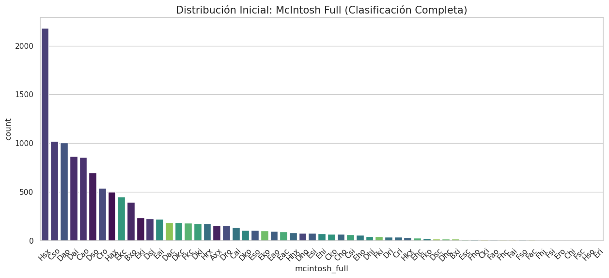

# Lenguaje de Programación Visual  
## Ingeniería Mecatrónica

**Semana 9: Analisis y Preparacion de Datos**

---

## Crear entorno virtual con Conda + Jupyter Notebook

Habiendo instalado [Anaconda](https://www.anaconda.com/products/distribution) o [Miniconda](https://docs.conda.io/en/latest/miniconda.html), para crear un entorno virtual se tienen los siguientes pasos:

1. Abrir la terminal o consola de Windows.

2. Crear un entorno virtual con Conda:

```bash
conda create -n lpv2026-1 python=3.12 -y
```

3. Activar el entorno virtual:

```bash
conda activate lpv2026-1
```

4. Instalar dependencias

```bash
conda install numpy matplotlib scipy pandas seaborn scikit-learn ipykernel jinja2

```

5. Registro de entorno en Jupyter

```bash
python -m ipykernel install --user --name lpv2026-1 --display-name "Python (lpv2026-1)"
```

---

## Flujo de Trabajo: Análisis y Preparación de Datos

El proyecto sigue un pipeline riguroso de preparación de datos para asegurar la calidad del análisis:

### 1. Carga de Datos
Se utiliza `pandas` para la lectura de archivos CSV. En esta etapa se identifica la estructura del dataset y se separan los parámetros físicos (metadatos) de las etiquetas de clasificación.

<p align="center">
  
</p>

### 2. Limpieza Inicial
- **Tratamiento de Nulos**: Se eliminan todas las filas que contengan valores faltantes (`NaN`) para evitar sesgos en el cálculo estadístico.
- **Limpieza de Columnas**: Se descartan aquellas columnas que no aportan información relevante o que están completamente vacías.
- **Ingeniería de Características**: Se descomponen campos complejos (como `mcintosh_full`) en componentes individuales para un análisis granular.

### 3. Normalización de Metadatos
Para que el análisis de componentes principales (PCA) sea efectivo y las entradas sean uniformes, se aplica una **Normalización Min-Max (Rango 0 a 1)**. Esto escala cada parámetro físico de modo que el valor mínimo sea 0 y el máximo sea 1, asegurando que todas las variables contribuyan equitativamente sin importar sus unidades originales.

### 4. Detección y Retiro de Outliers
Se emplea el algoritmo **Isolation Forest** sobre los datos normalizados. Este método identifica registros que se alejan significativamente del comportamiento global (anomalías). 
- Los outliers son visualizados en un espacio 3D mediante PCA.
  <p align="center">
    
  </p>
- Finalmente, se retiran estos registros para generar una base de datos "limpia" (`sunspot_data_clean.csv`), ideal para entrenar modelos de aprendizaje automático.
