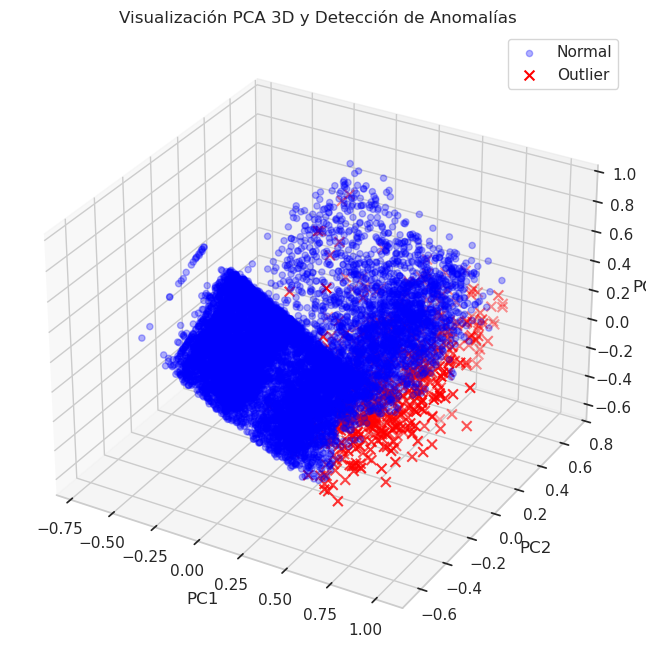

## Lenguaje de Programación Visual  
### Ingeniería Mecatrónica

**Semana 7: Monitor en Tiempo Real** 

<p align="center">
  
</p>


Este es un ejemplo de monitoreo en tiempo real de un motor simulado. El cliente PyQt6 muestra gráficos de velocidad y temperatura, con controles para iniciar/detener el motor y ajustar límites. El servidor emplea FastAPI (Los detalles de FastAPI los veremos en la siguiente clase) y simula la temperatura y la velocidad de un motor mediante:

```python
async def loop():
    phase = 0.0
    while True:
        await asyncio.sleep(0.3)
        if state["running"]:
            phase += 0.25
            target_speed = 2800 + 450 * math.sin(phase) + random.uniform(-80, 80)
            state["speed"] += 0.20 * (target_speed - state["speed"])
            target_temp = 40 + state["speed"] / 120 + random.uniform(-0.4, 0.4)
            state["temp"] += 0.05 * (target_temp - state["temp"])
        else:
            state["speed"] += 0.18 * (0.0 - state["speed"])
            state["temp"] += 0.05 * (25.0 - state["temp"])

        if abs(state["speed"]) < 0.5:
            state["speed"] = 0.0
        state["over"] = state["speed"] > state["limit"]
```


## Instalación
```bash
# Cliente
cd client
poetry install

# Servidor
cd server
poetry install
```

## Ejecución
1. Servidor: `cd server && poetry run motor-server`
2. Cliente: `cd client && poetry run motor-client`

## Características
- Gráficos en tiempo real con scrolling
- Límites ajustables para velocidad y temperatura
- LEDs parpadeantes en alertas
- Multihilo para performance fluida


## Tarea: Migración a Arduino
La consigna migrar el codigo de simulación del servidor a Arduino y cambiar el cliente a comunicación por red a un cliente por comunicación serial, teniendo en cuenta que la estructura del proyecto base es
Estructura del Proyecto
```
client/src/motor_client/
├── main.py              # Punto de entrada
├── config.py            # Constantes
├── logic/
│   └── app_logic.py     # Lógica
├── data/
│   └── updater.py       # Hilo para datos
└── ui/
    ├── controls.py      # Controles UI
    ├── plots.py         # Gráficos
    └── main_window.py   # Ventana principal
```